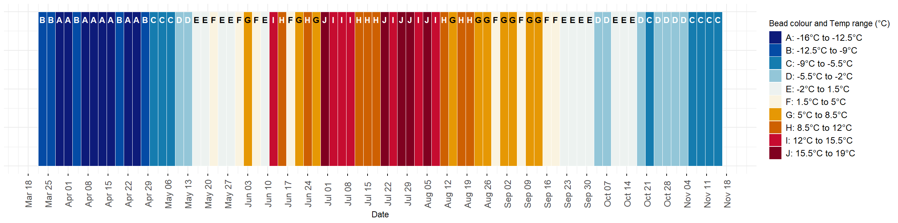

# DataVis Bracelets
*Using Beaded Bracelets for Data Visualization*

This is an activity designed by Bailey Bingham and adapted from many other similar data visualization activities—from temperature scarves and blankets to the #ShowYourStripes beaded bracelet project.
The data presented here is from Qikiqtaruk — Herschel Island, which is located off the north coast of the Yukon in the Tariuq (Beaufort Sea). Qikiqtaruk lies within the Inuvialuit Settlement Region and is part of Qikiqtaruk Territorial Park, which is co-managed by the Inuvialuit and the Yukon Government. The island holds deep cultural significance for the Inuvialuit and remains an active and meaningful part of the Inuvialuit homeland. 

## The Data
The data we are presenting are temperature data collected from 40 microclimate stations across Qikiqtaruk—Herschel Island since 2022. The raw data and details about the data collection process are available [here](https://github.com/baileybingham/TOMST-QHI/tree/main). 
In this activity, we have visualized the data from the 2023 growing season on the island, which was notable due to an extended heat wave that occurred in the second week of July, and caused profound permafrost thaw on the island, leading to the development of over 700 landslides, disturbing 1% of the island's area. 

## The Activity 
This activity is designed for youths ages 10-18. I have provided the data organization, materials and instructions to create single strand beaded bracelets that visualize the air temperature data from Qikiqtaruk - Herschel Island during the 2023 field season. 

### Bracelet Sizes
We will use seed beads (glass) or pony beads (plastic) for this activity. Seed bead sizes are typically denoted by a number followed by a slash and another number (i.e. 11/0, 8/0, or 15/0) or by the diameter of the bead in mm (i.e. 11/0 is 2.1mm diameter). The number before the slash indicates the number of seed beads that can fit within one inch. 11/0 (2mm) is the standard size for seed beads, but the holes are quite small, so 8/0 (3mm) or 6/0 (if working with younger children) is reccommended for bracelet making, especially if you wanted the bracelet making to take less time. 

#### Wrist sizes and number of beads with size 8/0
16.5cm or 6.5" : 52 beads

19cm or 7.5" : 60 beads

21.5cm or 8.5" : 68 beads

24cm or 9.5" : 76 beads

I will design the bracelet pattern to be 8.5". If the students' wrist is smaller, they can start their bracelet further into the season. If it is larger than that, then they can add some solid coloured beads on either side to make up the space. 

### Bracelet Pattern

